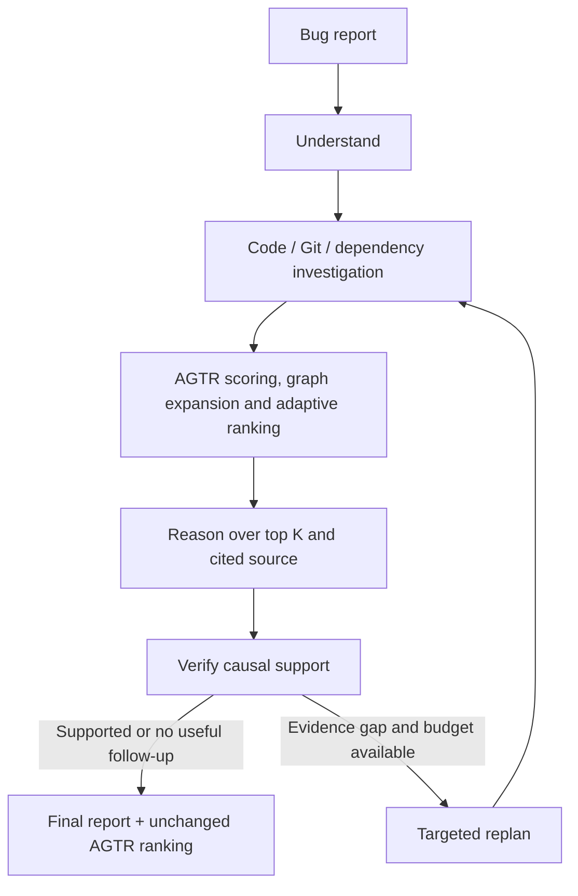

# Agent investigation + legacy AGTR

This branch (`agent-agtr`) implements the combined system. `main` remains the
standalone AGTR baseline and `agent` remains the standalone agent baseline.
The branch references are not changed by this implementation.

## Execution



AGTR is an explicit LangGraph node after every investigation round. It ranks the
accumulated candidates; it is not a finalization fallback. Replanning returns
through investigation and AGTR before reasoning again. A supported first round
ends immediately. The Python orchestrator owns budgets and routing.

The reasoner sees candidate IDs in AGTR order with their raw signal scores,
combined scores, rank and signal availability. It receives up to
`AGTR_LLM_CANDIDATES` candidates. Newly discovered top candidates are read through
the existing bounded, project-scoped tool executor before reasoning. An 8,500
character evidence packet prioritizes their code, so the shortlist does not imply
that all source bodies fit. A hypothesis must cite source evidence actually
visible in that packet. Every hypothesis below rank 1 must provide
`ranking_rationale`; the verifier checks the explanation and cited mechanism.
The report preserves the selected candidate's AGTR rank and rationale.

## Scoring and weights

The combined implementation imports existing functions from `analysis/agtr.py`
and `analysis/graph_expander.py`. It also calls the existing Git scorer with an
explicit strict mode; the standalone pipeline retains its default behavior.

1. **Semantic:** compute cosine similarity against one canonical query (the
   understood bug summary) for every candidate, including keyword and graph
   discoveries. Clamp to `[0, 1]`. Never mix scores from different tool queries.
   Cache the query embedding within the run. Missing or non-finite scores disable
   this entire channel so an unscored candidate is not silently disadvantaged.
2. **Graph:** use the legacy undirected personalized PageRank with `alpha=0.85`
   across the project's complete `CALLS` / `DEPENDS_ON` edge set. Restart mass
   comes from semantic seed scores; if those are unavailable or all zero, use
   uniform mass over seeds and record that choice. Expand candidates with the
   legacy adaptive depth: raw semantic seed gap `C > 0.30` gives 1 hop,
   `C > 0.15` gives 2 hops, otherwise 3. Rescore new candidates semantically.
   The gap is `top score - mean(other scores)` (one seed uses its own score).
3. **Git:** reuse `T(v) = max_commit(R(v) * exp(-0.05 * age_days))`. Relevance is
   capped at 1: base 0.30 for aligned function overlap, otherwise 0.15 for a
   same-file change, plus 0.40 per matching search term in the commit message and
   0.30 per term in the diff. All rounds use `AnalysisResult.createdAt` as the
   time anchor. Both ranking and the history tool exclude later commits.
   Historical hunk coordinates count as function overlap only for a commit
   matching the indexed revision; older changes contribute at file level.
   Candidates with no eligible changes get zero temporal score.

Weights use the same **final candidate pool** for all three channels:

```text
C_signal = (top score - mean(other scores)) / population_stddev(all scores)
q_signal = sigmoid(1.5 * (C_signal - 1.0))
w_signal = q_signal / sum(q for available signals)

AGTR(v) = ws * minmax(S(v)) + wg * minmax(G(v)) + wt * minmax(T(v))
```

The implementation reuses the legacy rounded z-score gaps and rounded adaptive
weights, then masks unavailable signals and renormalizes to six decimal places.
Final combined and raw signal scores are stored to four decimals by the legacy
ranker. A constant channel has gap zero and normalized values zero; its sigmoid
weight may remain positive, preserving the legacy formula. A single candidate
therefore has combined score zero, even when its source supports a hypothesis.

Unavailable channels get weight zero. All channels unavailable yields zero
weights and a visibly marked, meaningless zero-score order; it is never presented
as calibrated confidence. Ties use chunk ID order within the same index generation.
`confidence` and `confidenceValue` remain null for agent reports. A high AGTR
score is a prioritization signal, not causal proof or a probability.

## Storage and UI

Existing Prisma columns are sufficient; **this integration needs no new schema
migration**. Each completed rank stage writes all ranking fields and its context
snapshot in a single update, under the existing project lock:

| AnalysisResult column | Content |
| --- | --- |
| `semanticScores` | `{chunkId, score}` for every ranked candidate |
| `graphScores` | Same candidate IDs, raw PageRank scores |
| `gitScores` | Same candidate IDs, raw temporal scores |
| `finalRanking` | Ordered candidates with rank, paths, function names, combined score and three raw scores |
| `agtrWeights` | Actual adaptive `{ws, wg, wt}` used in fusion |
| `semanticGap` | Seed gap used to choose traversal depth |
| `hopsUsed` | Selected depth, or zero if graph scoring is unavailable |
| `dependencyPath` | Up to ten observed graph paths; approximate relationships |
| `evidenceContext` | `engine: agentic`, `variant: agent-agtr`, schema version 2, per-round ranking history, phase outputs, availability and warnings |

The main columns hold the latest completed rank stage. Earlier rounds remain in
`evidenceContext.ranking_history`, with the query, time anchor and signal gaps.
Finalization preserves the exact ranking supplied to reasoning. The final root
cause fields reflect the verified hypothesis, which can differ from rank 1.
An interrupted or failed investigation can retain its last completed ranking.

The Decision Timeline shows an expandable AGTR stage for each round. The Executive
Report displays the latest persisted weights and candidate table, marks the
selected hypothesis, and shows its selection rationale. Raw signal columns are
explicitly distinguished from the normalized values used in fusion.

## Files and configuration

| File | Responsibility |
| --- | --- |
| `ai-server/app/analysis/agentic_agtr.py` | Candidate fusion, availability, ranking snapshots and column projection |
| `ai-server/app/agents/graph.py` | Rank node, ranked reasoning and replan loop |
| `ai-server/app/tools/repository.py` | Project-scoped scoring queries and time-filtered history |
| `ai-server/app/analysis/git_scorer.py` | Legacy temporal formula, optional strict time/alignment behavior |
| `ai-server/app/analysis/agentic_pipeline.py` | Atomic progress persistence and exact analysis identity |
| `ai-server/app/agents/prompts/reason.md`, `verify.md` | Rank-aware causal reasoning and evidence review |
| `client/src/components/AgentAGTRRanking.tsx` | Shared per-round/latest rank table and weight display |

Use the [MVP setup guide](agentic-rca-mvp.md) to start PostgreSQL, Neo4j, the Python
API and worker, Express and the client. Restart the Python API and worker after
changing branches or configuration, then submit a new analysis. Existing
completed reports are not recomputed automatically.

```dotenv
# Reasoning and embeddings remain independently selectable: local or cloud.
REASONING_PROVIDER=cloud
EMBEDDING_PROVIDER=local

# Bounded candidate pool and reasoning shortlist.
AGTR_MAX_CANDIDATES=40
AGTR_LLM_CANDIDATES=10
```

No additional model or dependency is needed for AGTR. Local embeddings continue
to use the configured Ollama model; cloud embeddings continue to use Gemini.
Switching only reasoning or adding AGTR does not require reindexing. Changing
embedding providers/models does. Older indexes without provenance still need the
MVP's existing reindex step.

## Tests and research boundaries

From `ai-server/`:

```bash
PYTEST_DISABLE_PLUGIN_AUTOLOAD=1 uv run pytest -q
# Real PostgreSQL/pgvector and Neo4j; scripted reasoning and query vectors.
RUN_AGTR_SERVICES=1 PYTEST_DISABLE_PLUGIN_AUTOLOAD=1 uv run pytest tests/test_agentic_agtr_services.py -q
```

Focused tests cover canonical rescoring, expansion, the legacy weight/fusion
formula, unavailable channels, deterministic ties, time anchoring, historical
coordinates, per-round ranking, persisted columns and evidence-based rank
disagreement. The service test creates and removes only its own records, checks
project isolation, and confirms ranking is committed before reasoning and is
not overwritten at finalization. This test verifies integration rather than LLM
accuracy; the optional live-model test remains in `tests/test_live_rca.py`.

The MVP bounds the candidate pool (default 40), graph query (20,000 returned
directed edge pairs from an undirected match), Git scoring (latest 100 eligible
change rows), source packet and tool/model calls. A graph exceeding its bound is
marked unavailable instead of computing partial PageRank. Candidate expansion
truncation is reported. When the pool is full, explicit agent discoveries replace
the lowest-ranked candidates that were added only by graph expansion. If every
slot already belongs to an explicit discovery, later omissions are reported.
Call edges remain approximate name matches; runtime tests
are not executed and commit recency does not establish an introducing commit.

Compare semantic retrieval, standalone AGTR, standalone agents and this combined
branch on the same buggy revisions and bug reports, with fixed provider settings
and budgets. Report localization metrics separately from explanation support,
cost and latency. For retrospective evaluation, prepare the buggy repository
snapshot and pre-fix history: the analysis timestamp alone does not remove
future-fix leakage from a repository that already contains the fix. This
implementation enables the comparison; it does not establish better accuracy
without benchmark results.
