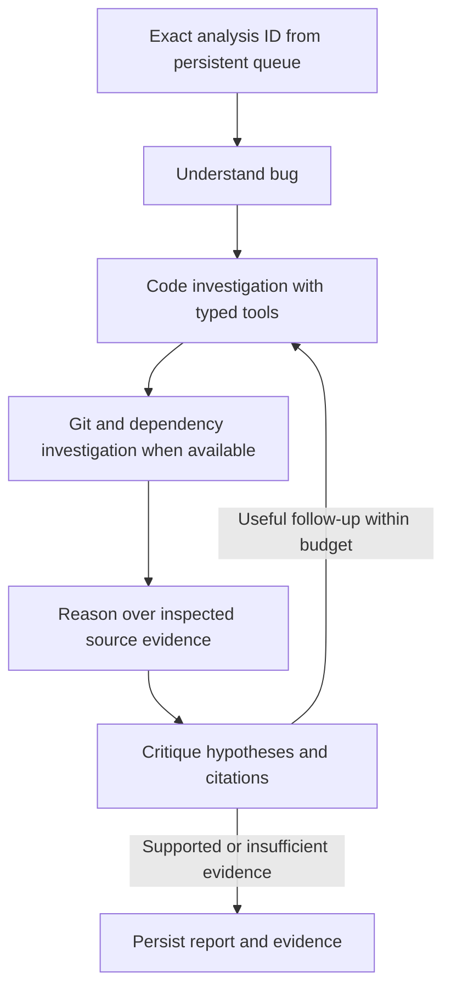

# Agentic RCA MVP: implementation and setup

This guide describes the implemented MVP. The earlier plan remains the longer-term
design. Core priorities are independent providers, real tools, source-backed claims,
bounded control flow, and reliable analysis identity.

## Independent reasoning and embedding options

Edit `ai-server/.env`, then restart the Python API and worker:

| Reasoning | Embeddings | Settings | API key required? |
| --- | --- | --- | --- |
| Cloud | Local | `REASONING_PROVIDER=cloud`, `EMBEDDING_PROVIDER=local` | For reasoning |
| Local | Cloud | `REASONING_PROVIDER=local`, `EMBEDDING_PROVIDER=cloud` | For embeddings |
| Local | Local | Both `local` | No |
| Cloud | Cloud | Both `cloud` | Yes |

Cloud currently uses Gemini; local uses Ollama. There is no automatic cloud
fallback when local inference fails. Credentials stay in the Python service.

```dotenv
REASONING_PROVIDER=cloud
EMBEDDING_PROVIDER=local
GEMINI_API_KEY=your-key
GEMINI_MODEL_NAME=gemini-3.6-flash
EMBEDDING_MODEL_NAME=gemini-embedding-001
CLOUD_REASONING_REQUESTS_PER_MINUTE=5
OLLAMA_BASE_URL=http://localhost:11434
LOCAL_REASONING_MODEL=llama3.2:3b
LOCAL_EMBEDDING_MODEL=nomic-embed-text
LOCAL_JSON_SCHEMA=true
LOCAL_LLM_TIMEOUT_SECONDS=180
```

The existing configured cloud model and installed local reasoning model are the
defaults. Check availability for your own account/machine. For local inference:

```bash
ollama pull nomic-embed-text
ollama pull llama3.2:3b
```

Nomic uses `search_document:` and `search_query:` prefixes in the adapter. Vectors
are validated at 768 dimensions, matching the database. Arbitrary resizing is not
supported. Every index records provider/model, local model digest when available,
dimension and preprocessing configuration. Different embedding spaces cannot be
mixed even with equal dimensions. **Reindex after switching embedding providers
or models.** Switching only reasoning does not require reindexing.

For completely local analysis, set both switches to `local`. Downloading models
and cloning a remote repository still require network access. A local reasoner
can intentionally use cloud embeddings: the switches are fully independent.

## Install and run

Prerequisites: Python 3.10+, uv, Node, pnpm 10.20.0, Git, Docker Compose, and Ollama
if either provider is local. This checkout's Python 3.10 environment is supported;
package versions are locked in `ai-server/uv.lock`.

From the repository root:

```bash
docker compose up -d
```

For an existing application database, from `ai-server/`:

```bash
uv sync --frozen
# New checkout only: preserve your real .env if it already exists.
cp .env.example .env
# Edit database credentials and cloud key as appropriate.
uv run python -m app.cli setup
uv run python -m app.cli doctor
uv run python -m app.cli doctor --probe-model
```

`setup` applies `server/prisma/agentic-mvp.sql`, an additive, idempotent change.
Existing projects/results are preserved. Legacy indexes have no provider
provenance and must be reindexed before agentic analysis.

For an empty development database, initialize the application schema first,
from `server/`:

```bash
pnpm install --frozen-lockfile
pnpm exec prisma db push
pnpm exec prisma generate
```

Use `db push` for a new development database. Apply the additive SQL to an existing
database. This repository had no Prisma migration history; `migrate deploy` does
not initialize the original application schema here.

`doctor` checks selected profiles, installed local embedding metadata, DB
connectivity and the MVP table. `--probe-model` also makes an embedding request
and a structured reasoning request, which may consume API quota.

Start four processes in separate terminals:

```bash
# ai-server/: indexing and health HTTP API
uv run uvicorn main:app --reload --port 8000
```

```bash
# ai-server/: durable analysis worker
uv run python worker.py
```

```bash
# server/: Express API
pnpm dev
```

```bash
# client/: React UI
pnpm install --frozen-lockfile
pnpm dev
```

Create/reindex a project in the UI, wait for READY, then submit a bug. The result
page polls progress and shows hypotheses, evidence, limitations and stop reason.
Without the Python worker, analyses remain queued.

## Workflow and ordinary-model support



The orchestrator is deterministic LangGraph routing. Specialist roles use the
configured model with separate prompts. The verifier can request focused code,
Git or dependency investigation for another round. Defaults allow three rounds,
24 model attempts, 30 tool requests and ten minutes per execution attempt. A role
gets at most four action steps. No new evidence stops reinvestigation; repeated
immutable tool calls return cached observations.

Models without native function calling request tools through validated JSON:

```json
{
  "response": {
    "action": "tool",
    "tool": "read_code",
    "arguments": {"chunk_id": "a-real-retrieved-id", "offset": 0, "lines": 80}
  }
}
```

The application executes the tool and returns an observation. A finish action
contains a typed finding. Invalid JSON gets one bounded repair. Provider retries
and repairs consume the global model budget. Both providers use this same JSON
protocol; native function calling is a later optimization.

Ollama's optional JSON-schema output constraint is enabled by default. It constrains
text generation; it does not grant native tool execution. Set LOCAL_JSON_SCHEMA=false
for plain JSON with the same application validation. Local action replies have a
512-token output cap and reasoning replies a 1500-token cap. Cloud JSON output
allows more room for thinking models and uses low thinking effort for Gemini 3.

The 3B local model is the default because this machine runs Ollama on CPU. The
larger installed 8B model is configurable but may need a longer timeout. Exhausted
daily cloud quotas fail explicitly without repeated retries.

Cloud requests are paced at five per minute by default, matching the configured
account's observed limit. Set this to your actual allowance. Pacing is process-wide;
use one MVP worker per provider quota. Cross-process quota coordination is not
implemented. The deadline includes quota waiting; in-flight requests also have
transport timeouts.

## Modules

| Path under `ai-server/app/` | Responsibility |
| --- | --- |
| `config.py` | Independent provider settings and budgets |
| `llm/factory.py` | ChatGoogleGenerativeAI or ChatOllama |
| `llm/structured_output.py` | Prompt loading, generation, JSON/schema validation |
| `llm/rate_limit.py` | Cloud pacing and transient failure classification |
| `embeddings/gemini.py` | Existing cloud batch embedding, retry and pacing |
| `embeddings/local.py` | Local embedding requests, prefixes and vector validation |
| `embeddings/fingerprint.py` | Index/query compatibility |
| `indexing/embedder.py` | Shared embedding facade and chunk persistence |
| `agents/contracts.py`, `state.py` | Validated model contracts and graph state |
| `agents/graph.py` | Workflow, routing, verification and finalization |
| `agents/runner.py` | Bounded role/tool conversation |
| `agents/prompts/*.md` | Shared grounding and role-specific prompts |
| `tools/schemas.py`, `executor.py` | Typed registry, permissions, evidence/cache |
| `tools/repository.py` | Parameterized project-scoped repository queries |
| `repositories/indexes.py` | Provenance and project session locks |
| `repositories/paths.py` | Ingestion path/exclusion checks |
| `analysis/agentic_pipeline.py` | Exact-ID run, persistence and result mapping |
| `worker.py` | Durable polling and bounded restart attempts |
| `cli.py` | Schema setup and diagnostics |

Express creates one pending AnalysisResult with an agentic engine marker. That
row is the queue; processing does not depend on a fire-and-forget HTTP call.
Python's compatibility enqueue endpoint accepts both analysis_id and bug_report_id
and is idempotent. AgenticReportPanel renders the new contract; historical AGTR
results keep their previous presentation.

## Tools and evidence

Tools provide literal keyword search, semantic search, bounded chunk reads,
candidate-file Git diffs and direct dependency neighbors. Models get no arbitrary
SQL, Cypher, shell, file path or project-ID parameter. LangChain StructuredTool and
Pydantic schemas define both the catalog and executor validation. Role allowlists
are enforced before invocation. Chunk IDs resolve only within the trusted project.

Tools distinguish empty results, unavailable history and execution failures.
Source observations have stable IDs, generation/revision, paths, line ranges,
hashes and bounded excerpts. Search hits remain candidates until code is read.
Hypotheses must cite code for their candidate. The verifier receives those cited
observations; its choice and citations are validated before finalization.

The UI shows no invented accuracy percentage. A supported hypothesis is explicitly
a static evidence review. Tests/code are not executed; inconclusive is a valid
completed outcome.

## Persistence and consistency

Indexing and analysis share a Postgres advisory session lock per project, so
reindexing cannot replace chunks/graph during an investigation. Tool/model calls
and result writes check/use the same owning session. A disconnected old worker
cannot reconnect and overwrite a replacement run.

Checkouts use unique durable directories under `ai-server/data/repositories/`.
Completed indexes publish a generation and embedding fingerprint. Failed indexing
leaves the project failed and ineligible for analysis until reindexed. The MVP
preserves source excerpts in reports but does not keep multiple queryable DB index
generations or atomically switch an entire staged graph. Checkout retention and
garbage collection remain manual.

Queued rows survive restarts. A crashed worker releases its lock; another can
restart the processing row up to RCA_JOB_MAX_ATTEMPTS. Each attempt is a fresh
bounded investigation, not checkpoint resumption, and may repeat model charges.
Changed index generation or reasoning configuration fails an interrupted run
clearly rather than switching its evidence/model silently.

## Tests

```bash
# ai-server/: deterministic suite
PYTEST_DISABLE_PLUGIN_AUTOLOAD=1 uv run pytest -q

# Real services/models; creates and cleans up its own fixture.
RUN_LIVE_RCA=1 PYTEST_DISABLE_PLUGIN_AUTOLOAD=1 uv run pytest tests/test_live_rca.py -q -s

# Same end-to-end fixture fully locally.
REASONING_PROVIDER=local EMBEDDING_PROVIDER=local RUN_LIVE_RCA=1 PYTEST_DISABLE_PLUGIN_AUTOLOAD=1 uv run pytest tests/test_live_rca.py -q -s
```

Plugin autoload is disabled because this machine exports unrelated ROS pytest
plugins. The suite covers provider independence, malformed JSON, repair limits,
tool permissions, source ownership, invalid citations, no-progress termination,
budgets, and the existing retrieval/scoring tests.

The live test creates its own project/user/bug, indexes an inverted session-expiry
comparison, checks project locking, runs the analysis twice to verify terminal
idempotence, and checks source-backed localization. Cleanup removes only its own
rows, graph nodes and checkout.

## Deliberate MVP boundaries

- Sequential roles; no parallel agents or distributed quota coordination.
- JSON actions; no native-tool capability negotiation yet.
- AST call edges are approximate name matches, not confirmed runtime paths.
- Git evidence is stored diff excerpts with historical-coordinate/truncation caveats;
  the MVP does not claim an introducing commit from recency alone.
- Agentic candidate ordering is semantic relevance. Git/dependencies are evidence
  for reasoning. Original AGTR math/pipeline and tests remain in the codebase;
  full adaptive multi-signal ranking is deferred.
- No shell, automatic patches, runtime verification, checkpoint resumption,
  cancellation UI, SSE, or benchmark dashboard.
- Existing authentication remains the single-user development setup. This is not
  a hardened public multi-tenant repository hosting service.

Framework references: [LangGraph graph API](https://docs.langchain.com/oss/python/langgraph/graph-api),
[ChatOllama](https://docs.langchain.com/oss/python/integrations/chat/ollama),
[Gemini](https://docs.langchain.com/oss/python/integrations/chat/google_generative_ai),
and [Ollama embeddings](https://docs.ollama.com/api/embed).
